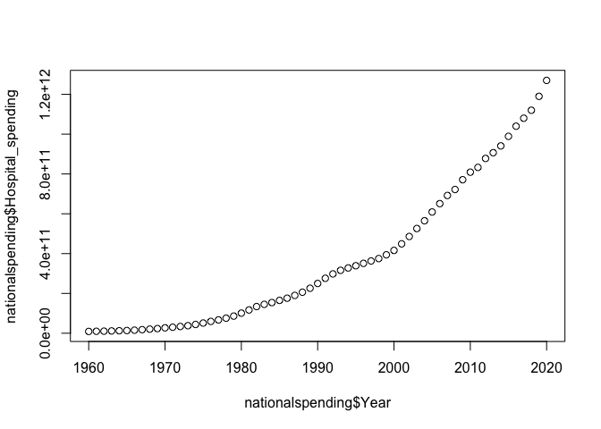
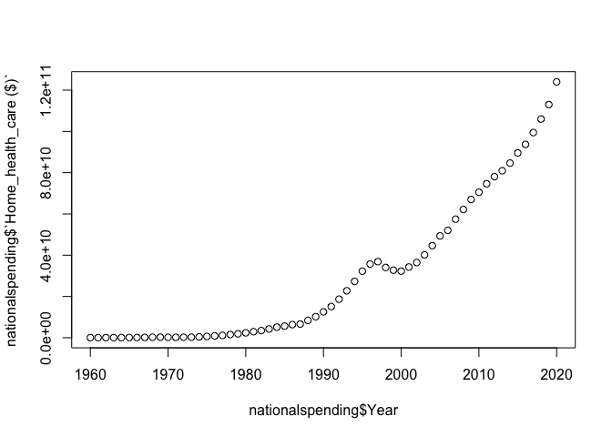
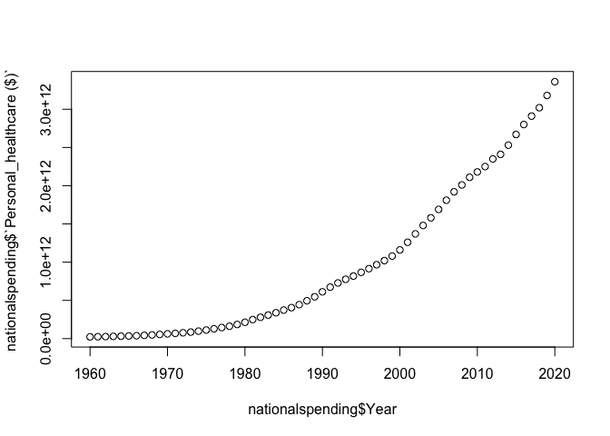
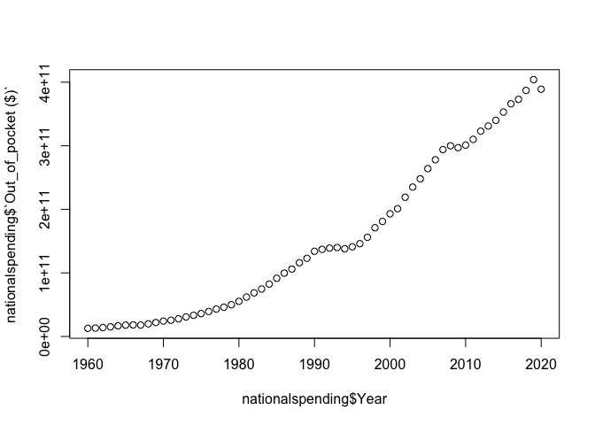
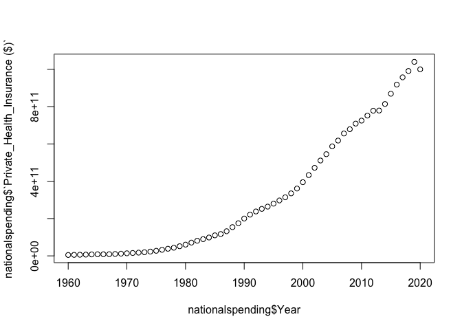
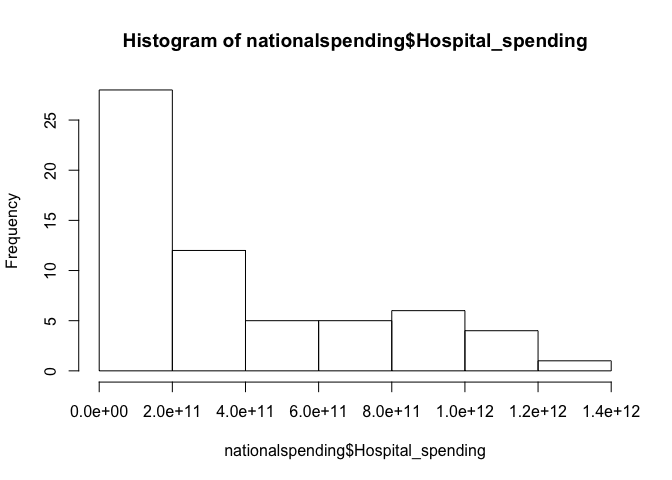
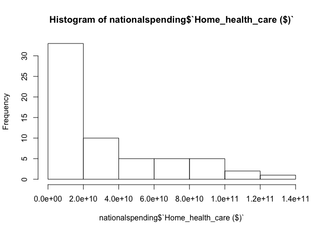
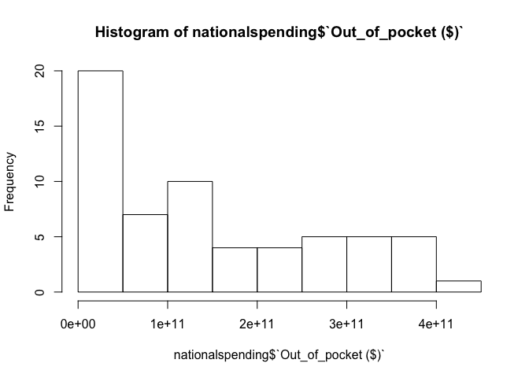
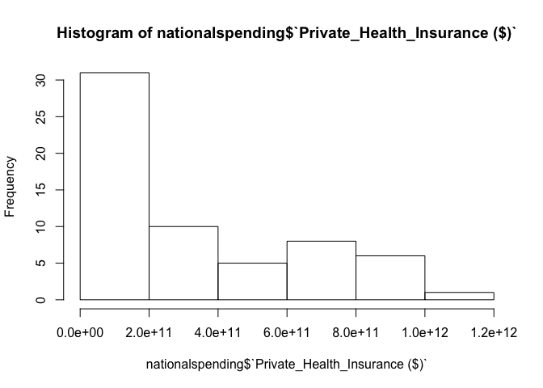

**FINAL PROJECT DRAFT**

## Introduction

**What**: For my final project, I originally wanted to find out the cost
of health care in us prior covid and post covid to determine if COVID-19
has affected the price of healthcare at all or not and by how much
compare to the previous years. But after looking for a data set, I could
not really find what I needed, so I have decided to put my focus on the
national spending on healthcare to analyse the amount on money spent on
hospital, home\_healthcare,personal healthcare, money paid out of pocket
and private insurance from 1960 to 2020. So I have decided to analyze
the data to see if there is any significant increase or decrease in the
spending since 1960 and if there is a correlation between year and each
category.

**Why**: I think it would be interesting to see if there is any increase
or decrease over time in each categories of spending and possibly find
events that may have impacted them.

**How**: I will try to explore datasets about national spending on
healthcare and expenditure cost and use R studio to make analysis and
visualization that show spending over time and how much money spent on
healthcare.

**Minimal scenario**: I explore the datasets but find there is no change
in the spending over time.

**Optimistic scenario**: I find the datasets and run my analysis and
find that there is a substantial change in the spending over time and
observe an increase or decrease in each spending category each year
since 1960 to 2020

**Ambitious scenario**: I explore the datasets and find that there is a
relationship between years and healthcare spending which prove that
healthcare cost will continue to go up or down year after year which
increase the spending in each category cited above.

# BODY

This data set is from the national spending on healthcare. it contains
61 observations and 6 variables that i will use to run my analysis and
explains the findings.

## Loading and Reading the dataset

    library(tidyverse)

    ## ── Attaching packages ──────────────────────────────────────────── tidyverse 1.3.1 ──

    ## ✔ ggplot2 3.3.6     ✔ purrr   0.3.4
    ## ✔ tibble  3.1.7     ✔ dplyr   1.0.9
    ## ✔ tidyr   1.2.0     ✔ stringr 1.4.0
    ## ✔ readr   2.1.2     ✔ forcats 0.5.1

    ## ── Conflicts ─────────────────────────────────────────────── tidyverse_conflicts() ──
    ## ✖ dplyr::filter() masks stats::filter()
    ## ✖ dplyr::lag()    masks stats::lag()

    library(readr)
    nationalspending <- read_csv("nationalspending.csv")

    ## Rows: 61 Columns: 6

    ## ── Column specification ─────────────────────────────────────────────────────────────
    ## Delimiter: ","
    ## dbl (6): Year, Hospital_spending, Home_health_care ($), Personal_healthcare ($), ...
    ## 
    ## ℹ Use `spec()` to retrieve the full column specification for this data.
    ## ℹ Specify the column types or set `show_col_types = FALSE` to quiet this message.

    View(nationalspending)
    read.csv("nationalspending.csv")

    ##    Year Hospital_spending Home_health_care.... Personal_healthcare....
    ## 1  1960        8.9850e+09           5.7000e+07              2.3124e+10
    ## 2  1961        9.7770e+09           6.1000e+07              2.4624e+10
    ## 3  1962        1.0432e+10           6.5000e+07              2.6530e+10
    ## 4  1963        1.1507e+10           6.9000e+07              2.8976e+10
    ## 5  1964        1.2501e+10           7.5000e+07              3.1825e+10
    ## 6  1965        1.3545e+10           8.9000e+07              3.4421e+10
    ## 7  1966        1.5298e+10           1.0800e+08              3.8009e+10
    ## 8  1967        1.7798e+10           1.6400e+08              4.2989e+10
    ## 9  1968        2.0537e+10           2.3800e+08              4.8624e+10
    ## 10 1969        2.3367e+10           2.7200e+08              5.4871e+10
    ## 11 1970        2.7168e+10           2.2000e+08              6.2369e+10
    ## 12 1971        3.0224e+10           1.9400e+08              6.8700e+10
    ## 13 1972        3.3846e+10           2.2000e+08              7.6389e+10
    ## 14 1973        3.7920e+10           2.7600e+08              8.5344e+10
    ## 15 1974        4.4139e+10           4.2300e+08              9.7827e+10
    ## 16 1975        5.1234e+10           6.2300e+08              1.1200e+11
    ## 17 1976        5.9402e+10           8.9600e+08              1.2800e+11
    ## 18 1977        6.7023e+10           1.1470e+09              1.4500e+11
    ## 19 1978        7.5621e+10           1.5560e+09              1.6200e+11
    ## 20 1979        8.6162e+10           1.8990e+09              1.8500e+11
    ## 21 1980        1.0100e+11           2.3780e+09              2.1400e+11
    ## 22 1981        1.1700e+11           2.9380e+09              2.4900e+11
    ## 23 1982        1.3400e+11           3.4820e+09              2.7900e+11
    ## 24 1983        1.4500e+11           4.2370e+09              3.0800e+11
    ## 25 1984        1.5400e+11           5.1290e+09              3.3800e+11
    ## 26 1985        1.6500e+11           5.6330e+09              3.7300e+11
    ## 27 1986        1.7600e+11           6.3680e+09              4.0500e+11
    ## 28 1987        1.9000e+11           6.6360e+09              4.4400e+11
    ## 29 1988        2.0600e+11           8.4060e+09              4.9500e+11
    ## 30 1989        2.2600e+11           1.0213e+10              5.4700e+11
    ## 31 1990        2.5000e+11           1.2534e+10              6.1200e+11
    ## 32 1991        2.7600e+11           1.5135e+10              6.7300e+11
    ## 33 1992        2.9800e+11           1.8690e+10              7.2800e+11
    ## 34 1993        3.1600e+11           2.2748e+10              7.7600e+11
    ## 35 1994        3.2800e+11           2.7307e+10              8.1800e+11
    ## 36 1995        3.3900e+11           3.2270e+10              8.6700e+11
    ## 37 1996        3.5100e+11           3.5716e+10              9.1500e+11
    ## 38 1997        3.6300e+11           3.6885e+10              9.6600e+11
    ## 39 1998        3.7500e+11           3.4072e+10              1.0200e+12
    ## 40 1999        3.9400e+11           3.2756e+10              1.0800e+12
    ## 41 2000        4.1600e+11           3.2294e+10              1.1600e+12
    ## 42 2001        4.4900e+11           3.4271e+10              1.2600e+12
    ## 43 2002        4.8600e+11           3.6465e+10              1.3700e+12
    ## 44 2003        5.2600e+11           4.0179e+10              1.4800e+12
    ## 45 2004        5.6500e+11           4.4641e+10              1.5800e+12
    ## 46 2005        6.0900e+11           4.9343e+10              1.6900e+12
    ## 47 2006        6.5100e+11           5.2052e+10              1.8100e+12
    ## 48 2007        6.9200e+11           5.7475e+10              1.9200e+12
    ## 49 2008        7.2200e+11           6.2165e+10              2.0100e+12
    ## 50 2009        7.7100e+11           6.6999e+10              2.1100e+12
    ## 51 2010        8.0900e+11           7.0525e+10              2.1800e+12
    ## 52 2011        8.3300e+11           7.4623e+10              2.2500e+12
    ## 53 2012        8.7800e+11           7.8076e+10              2.3500e+12
    ## 54 2013        9.0700e+11           8.0947e+10              2.4100e+12
    ## 55 2014        9.4100e+11           8.4647e+10              2.5300e+12
    ## 56 2015        9.8900e+11           8.9572e+10              2.6700e+12
    ## 57 2016        1.0400e+12           9.3720e+10              2.8000e+12
    ## 58 2017        1.0800e+12           9.9440e+10              2.9100e+12
    ## 59 2018        1.1200e+12           1.0600e+11              3.0200e+12
    ## 60 2019        1.1900e+12           1.1300e+11              3.1800e+12
    ## 61 2020        1.2700e+12           1.2400e+11              3.3600e+12
    ##    Out_of_pocket.... Private_Health_Insurance....
    ## 1         1.2778e+10                   4.8780e+09
    ## 2         1.3193e+10                   5.4440e+09
    ## 3         1.4085e+10                   6.0530e+09
    ## 4         1.5171e+10                   6.7820e+09
    ## 5         1.6669e+10                   7.7630e+09
    ## 6         1.7863e+10                   8.5630e+09
    ## 7         1.8132e+10                   8.6940e+09
    ## 8         1.7985e+10                   8.8950e+09
    ## 9         1.9951e+10                   1.0003e+10
    ## 10        2.1911e+10                   1.1781e+10
    ## 11        2.4208e+10                   1.3800e+10
    ## 12        2.5515e+10                   1.5526e+10
    ## 13        2.7805e+10                   1.7388e+10
    ## 14        3.0737e+10                   1.9423e+10
    ## 15        3.3311e+10                   2.3014e+10
    ## 16        3.6036e+10                   2.7203e+10
    ## 17        3.9281e+10                   3.2481e+10
    ## 18        4.3137e+10                   3.8163e+10
    ## 19        4.6043e+10                   4.3668e+10
    ## 20        4.9929e+10                   5.1643e+10
    ## 21        5.5258e+10                   6.0277e+10
    ## 22        6.1932e+10                   7.1032e+10
    ## 23        6.8606e+10                   8.1131e+10
    ## 24        7.4660e+10                   8.9794e+10
    ## 25        8.2417e+10                   9.8401e+10
    ## 26        9.1566e+10                   1.1000e+11
    ## 27        9.9655e+10                   1.1700e+11
    ## 28        1.0600e+11                   1.3200e+11
    ## 29        1.1600e+11                   1.5400e+11
    ## 30        1.2300e+11                   1.7500e+11
    ## 31        1.3400e+11                   2.0000e+11
    ## 32        1.3700e+11                   2.2100e+11
    ## 33        1.3900e+11                   2.3800e+11
    ## 34        1.4000e+11                   2.5200e+11
    ## 35        1.3800e+11                   2.6400e+11
    ## 36        1.4100e+11                   2.8000e+11
    ## 37        1.4600e+11                   2.9700e+11
    ## 38        1.5600e+11                   3.1400e+11
    ## 39        1.7100e+11                   3.3500e+11
    ## 40        1.8100e+11                   3.6100e+11
    ## 41        1.9300e+11                   3.9500e+11
    ## 42        2.0100e+11                   4.3300e+11
    ## 43        2.1900e+11                   4.7200e+11
    ## 44        2.3500e+11                   5.1100e+11
    ## 45        2.4800e+11                   5.4500e+11
    ## 46        2.6400e+11                   5.8700e+11
    ## 47        2.7800e+11                   6.1800e+11
    ## 48        2.9400e+11                   6.5600e+11
    ## 49        3.0000e+11                   6.7900e+11
    ## 50        2.9700e+11                   7.0900e+11
    ## 51        3.0100e+11                   7.2500e+11
    ## 52        3.1000e+11                   7.5200e+11
    ## 53        3.2300e+11                   7.7800e+11
    ## 54        3.3100e+11                   7.7900e+11
    ## 55        3.4000e+11                   8.1400e+11
    ## 56        3.5300e+11                   8.6900e+11
    ## 57        3.6600e+11                   9.1800e+11
    ## 58        3.7300e+11                   9.5700e+11
    ## 59        3.8700e+11                   9.9100e+11
    ## 60        4.0400e+11                   1.0400e+12
    ## 61        3.8900e+11                   1.0000e+12

### Summary of the dataset

    summary(nationalspending)

    ##       Year      Hospital_spending   Home_health_care ($) Personal_healthcare ($)
    ##  Min.   :1960   Min.   :8.985e+09   Min.   :5.700e+07    Min.   :2.312e+10      
    ##  1st Qu.:1975   1st Qu.:5.123e+10   1st Qu.:6.230e+08    1st Qu.:1.120e+11      
    ##  Median :1990   Median :2.500e+11   Median :1.253e+10    Median :6.120e+11      
    ##  Mean   :1990   Mean   :3.689e+11   Mean   :2.988e+10    Mean   :9.776e+11      
    ##  3rd Qu.:2005   3rd Qu.:6.090e+11   3rd Qu.:4.934e+10    3rd Qu.:1.690e+12      
    ##  Max.   :2020   Max.   :1.270e+12   Max.   :1.240e+11    Max.   :3.360e+12      
    ##  Out_of_pocket ($)   Private_Health_Insurance ($)
    ##  Min.   :1.278e+10   Min.   :4.878e+09           
    ##  1st Qu.:3.604e+10   1st Qu.:2.720e+10           
    ##  Median :1.340e+11   Median :2.000e+11           
    ##  Mean   :1.523e+11   Mean   :3.187e+11           
    ##  3rd Qu.:2.640e+11   3rd Qu.:5.870e+11           
    ##  Max.   :4.040e+11   Max.   :1.040e+12

    dim(nationalspending)

    ## [1] 61  6

    length(dim(nationalspending))

    ## [1] 2

    names(nationalspending)

    ## [1] "Year"                         "Hospital_spending"           
    ## [3] "Home_health_care ($)"         "Personal_healthcare ($)"     
    ## [5] "Out_of_pocket ($)"            "Private_Health_Insurance ($)"

    head(nationalspending)

    ## # A tibble: 6 × 6
    ##    Year Hospital_spending `Home_health_care ($)` `Personal_healthc…` `Out_of_pocket…`
    ##   <dbl>             <dbl>                  <dbl>               <dbl>            <dbl>
    ## 1  1960        8985000000               57000000         23124000000      12778000000
    ## 2  1961        9777000000               61000000         24624000000      13193000000
    ## 3  1962       10432000000               65000000         26530000000      14085000000
    ## 4  1963       11507000000               69000000         28976000000      15171000000
    ## 5  1964       12501000000               75000000         31825000000      16669000000
    ## 6  1965       13545000000               89000000         34421000000      17863000000
    ## # … with 1 more variable: `Private_Health_Insurance ($)` <dbl>

    tail(nationalspending)

    ## # A tibble: 6 × 6
    ##    Year Hospital_spending `Home_health_care ($)` `Personal_healthc…` `Out_of_pocket…`
    ##   <dbl>             <dbl>                  <dbl>               <dbl>            <dbl>
    ## 1  2015      989000000000            89572000000       2670000000000     353000000000
    ## 2  2016     1040000000000            93720000000       2800000000000     366000000000
    ## 3  2017     1080000000000            99440000000       2910000000000     373000000000
    ## 4  2018     1120000000000           106000000000       3020000000000     387000000000
    ## 5  2019     1190000000000           113000000000       3180000000000     404000000000
    ## 6  2020     1270000000000           124000000000       3360000000000     389000000000
    ## # … with 1 more variable: `Private_Health_Insurance ($)` <dbl>

### LINEAR REGRESSION

**Year VS hospital\_spending Analysis**

Graphical Analysis

    plot(nationalspending$Year, nationalspending$Hospital_spending)

 After
plotting the variables, we first observe that as year increase hospital
spending increase too. we also observe hospital spending stay the same
from 1960 to 1980 then rapidly increase from 1980 to 2020.many factors
may have impacted this, among them we can talk about demographics. since
1980 represents the beginnings of millennial and Gen Y. This can also be
explained the increase of spending with new parents welcoming their new
born.

Testing for correlations

    cor(nationalspending$Hospital_spending, nationalspending$Year)

    ## [1] 0.941954

As we could see Cor= 0.94 is close to 1 which means there is a strong
positive linear relationship between year and hospital spending.

**Linear Regression Diagnostics**

    HS_model <- lm(nationalspending$Hospital_spending ~ nationalspending$Year)
    summary(HS_model)

    ## 
    ## Call:
    ## lm(formula = nationalspending$Hospital_spending ~ nationalspending$Year)
    ## 
    ## Residuals:
    ##        Min         1Q     Median         3Q        Max 
    ## -1.497e+11 -1.112e+11 -2.865e+10  9.141e+10  3.185e+11 
    ## 
    ## Coefficients:
    ##                         Estimate Std. Error t value Pr(>|t|)    
    ## (Intercept)           -3.828e+13  1.793e+12  -21.34   <2e-16 ***
    ## nationalspending$Year  1.942e+10  9.012e+08   21.55   <2e-16 ***
    ## ---
    ## Signif. codes:  0 '***' 0.001 '**' 0.01 '*' 0.05 '.' 0.1 ' ' 1
    ## 
    ## Residual standard error: 1.239e+11 on 59 degrees of freedom
    ## Multiple R-squared:  0.8873, Adjusted R-squared:  0.8854 
    ## F-statistic: 464.4 on 1 and 59 DF,  p-value: < 2.2e-16

Both multiple R square and adjusted are &gt; 80 percent , Based on the
plot, linear model statistics and correlation coefficient for the
relationship between hospital spending and year is evident that the
relationship is positive, linear and relatively strong.

**Year VS Home\_health\_care Analysis**

Graphical Analysis

    plot(nationalspending$Year, nationalspending$`Home_health_care ($)`)

We can observe from the plot that there is a correlation between Home
health care and year. As year increase the spending of home healthcare
increase too where it stay constant until 1980 then increase from 1990
to fall a little from 1996 to 2001 and re increase until 2020. this can
be explained also demographics. 1996 represents the year of last
millennials born which means less expenses on healthcare.

    cor(nationalspending$`Home_health_care ($)`, nationalspending$Year)

    ## [1] 0.9130859

The relationship between home health care and year can be considered
positive and strong as the correlation coefficient 0.9130859 turns out
to be closer to 1

    HH_model <- lm(nationalspending$`Home_health_care ($)` ~ nationalspending$Year)
    summary(HH_model)

    ## 
    ## Call:
    ## lm(formula = nationalspending$`Home_health_care ($)` ~ nationalspending$Year)
    ## 
    ## Residuals:
    ##        Min         1Q     Median         3Q        Max 
    ## -1.786e+10 -1.256e+10 -3.659e+09  1.015e+10  3.986e+10 
    ## 
    ## Coefficients:
    ##                         Estimate Std. Error t value Pr(>|t|)    
    ## (Intercept)           -3.570e+12  2.093e+11  -17.06   <2e-16 ***
    ## nationalspending$Year  1.809e+09  1.052e+08   17.20   <2e-16 ***
    ## ---
    ## Signif. codes:  0 '***' 0.001 '**' 0.01 '*' 0.05 '.' 0.1 ' ' 1
    ## 
    ## Residual standard error: 1.446e+10 on 59 degrees of freedom
    ## Multiple R-squared:  0.8337, Adjusted R-squared:  0.8309 
    ## F-statistic: 295.8 on 1 and 59 DF,  p-value: < 2.2e-16

Both multiple R square and adjusted are &gt; 80 percent , Based on the
plot, linear model statistics and correlation coefficient for the
relationship between home healthcare and year is evident that the
relationship is positive, linear and relatively strong.

## YEAR VS PERSONAL\_healthcare

Graphical Analysis

    plot(nationalspending$Year, nationalspending$`Personal_healthcare ($)`)

 by
looking at this plot we can first see that we have a pretty strong
positive correlation between personal healthcare spending and year
because it keeps increasing from 1960 to 2020and remain constant until
1980 then slightly increase until 1990 to rise again until now. This can
be explains by demographics, technology innovation and increase of
income.

    cor(nationalspending$`Personal_healthcare ($)`, nationalspending$Year)

    ## [1] 0.9399102

The relationship between personal health care and year can be considered
positive and strong as the correlation coefficient 0.9399102 turns out
to be closer to 1.

    PHh_model <- lm(nationalspending$`Personal_healthcare ($)` ~ nationalspending$Year)
    summary(PHh_model)

    ## 
    ## Call:
    ## lm(formula = nationalspending$`Personal_healthcare ($)` ~ nationalspending$Year)
    ## 
    ## Residuals:
    ##        Min         1Q     Median         3Q        Max 
    ## -3.821e+11 -3.400e+11 -7.165e+10  2.355e+11  7.945e+11 
    ## 
    ## Coefficients:
    ##                         Estimate Std. Error t value Pr(>|t|)    
    ## (Intercept)           -1.044e+14  4.981e+12  -20.95   <2e-16 ***
    ## nationalspending$Year  5.293e+10  2.503e+09   21.15   <2e-16 ***
    ## ---
    ## Signif. codes:  0 '***' 0.001 '**' 0.01 '*' 0.05 '.' 0.1 ' ' 1
    ## 
    ## Residual standard error: 3.442e+11 on 59 degrees of freedom
    ## Multiple R-squared:  0.8834, Adjusted R-squared:  0.8815 
    ## F-statistic: 447.1 on 1 and 59 DF,  p-value: < 2.2e-16

Both multiple R square and adjusted are &gt; 80 percent which is pretty
close 100% , Based on the plot, linear model statistics and correlation
coefficient for the relationship between home healthcare and year is
evident that the relationship is positive, linear and relatively strong.

## YEAR VS Out\_of\_pocket

Graphical Analysis

    plot(nationalspending$Year, nationalspending$`Out_of_pocket ($)`)

 Looking
at the pattern we can that as year increase, expense out of pocket in
health care increase too. we can then affirm that there is a positive
correlation between both variables. Other than that, we observe three
slightly pattern where the out of pocket remain steady then start
increase. from 1960 to 1990 which can be explained by demographic
increase in birth ( millennials), from 2000 to 2010 can explain by the
great recession 2008 then 2010 to 2020 which was affected by both the
recession and recently covid 19.

Testing for correlation between variables

    cor(nationalspending$`Out_of_pocket ($)`, nationalspending$Year)

    ## [1] 0.9701507

The relationship between out of pocket expense and year can be
considered positive and strong as the correlation coefficient 0.9701507
turns out to be closer to 1.

Linear regression analysis

    OP_model <- lm(nationalspending$`Out_of_pocket ($)` ~ nationalspending$Year)
    summary(OP_model)

    ## 
    ## Call:
    ## lm(formula = nationalspending$`Out_of_pocket ($)` ~ nationalspending$Year)
    ## 
    ## Residuals:
    ##        Min         1Q     Median         3Q        Max 
    ## -4.731e+10 -2.661e+10 -5.470e+09  2.374e+10  6.537e+10 
    ## 
    ## Coefficients:
    ##                         Estimate Std. Error t value Pr(>|t|)    
    ## (Intercept)           -1.344e+13  4.424e+11  -30.38   <2e-16 ***
    ## nationalspending$Year  6.830e+09  2.223e+08   30.73   <2e-16 ***
    ## ---
    ## Signif. codes:  0 '***' 0.001 '**' 0.01 '*' 0.05 '.' 0.1 ' ' 1
    ## 
    ## Residual standard error: 3.057e+10 on 59 degrees of freedom
    ## Multiple R-squared:  0.9412, Adjusted R-squared:  0.9402 
    ## F-statistic: 944.3 on 1 and 59 DF,  p-value: < 2.2e-16

Both multiple R square and adjusted are &gt; 90 percent which is pretty
close 100% , Based on the plot, linear model statistics and correlation
coefficient for the relationship between Out of pocket expense in
healthcare and year is evident that the relationship is positive, linear
and relatively strong.

## Year VS Private\_health\_Insurance

Graphical Analysis

    plot(nationalspending$Year, nationalspending$`Private_Health_Insurance ($)`)

At first look we can say that the relationship between private health
insurance and year is strong and positive. we can also observe that
spending on private kept increasing from 1960 until 2019. This can be
explained by demographics and new insurance business because the more
population increase the more people are available on the market. The
decrease that can observe from 2019 can be explained by covid 19 which
has cause many death and also also people were not working so thehy will
not be abale to pay their monthly insurance.

Testing for correlation between variables

    cor(nationalspending$`Private_Health_Insurance ($)`, nationalspending$Year)

    ## [1] 0.9432591

With a correlation of 0.9432591, we can say there is strong positive
relationship between Private insurance and year.

Linear regression analysis

    PH_model <- lm(nationalspending$`Private_Health_Insurance ($)` ~ nationalspending$Year)
    summary(PH_model)

    ## 
    ## Call:
    ## lm(formula = nationalspending$`Private_Health_Insurance ($)` ~ 
    ##     nationalspending$Year)
    ## 
    ## Residuals:
    ##        Min         1Q     Median         3Q        Max 
    ## -1.341e+11 -1.152e+11 -1.543e+10  7.495e+10  2.134e+11 
    ## 
    ## Coefficients:
    ##                         Estimate Std. Error t value Pr(>|t|)    
    ## (Intercept)           -3.454e+13  1.598e+12  -21.62   <2e-16 ***
    ## nationalspending$Year  1.752e+10  8.027e+08   21.82   <2e-16 ***
    ## ---
    ## Signif. codes:  0 '***' 0.001 '**' 0.01 '*' 0.05 '.' 0.1 ' ' 1
    ## 
    ## Residual standard error: 1.104e+11 on 59 degrees of freedom
    ## Multiple R-squared:  0.8897, Adjusted R-squared:  0.8879 
    ## F-statistic: 476.1 on 1 and 59 DF,  p-value: < 2.2e-16

Both multiple R square and adjusted are &gt; 80 percent which is pretty
close 100% , Based on the plot, linear model statistics and correlation
coefficient for the relationship between private health insurance and
year is evident that the relationship is positive, linear and relatively
strong.

## Histogram of all variables

    hist( x = nationalspending$Hospital_spending)

    hist( x = nationalspending$`Home_health_care ($)`)

    hist( x = nationalspending$`Personal_healthcare ($)`)

    hist( x = nationalspending$`Out_of_pocket ($)`)

    hist( x = nationalspending$`Private_Health_Insurance ($)`)

## VISUALAZATION OF ALL SPENDING IN A CHART PIE

    HS <- sum(nationalspending$Hospital_spending)
    HH <- sum(nationalspending$`Home_health_care ($)`)
    PHC <- sum(nationalspending$`Personal_healthcare ($)`)
    OP <- sum(nationalspending$`Out_of_pocket ($)`)
    PH <- sum(nationalspending$`Private_Health_Insurance ($)`)

    Slices <- c("HS","HH","PHC","OP","PH")
    lbls <- c("Hospitalspending", "homehealthcare", "personalhealthcare", "Outofpocket", "privatehealthins")

## Topic 1 : R markdown

R Markdown is a file format that help you turn your analysis in high
quality documents, reports, presentations and dashboard. During the
beginning of the semester, we have learned how to use R markdown through
class and the assignments. I created a new R Markdown that I am using
for this project. it will help make my finding clean and neat in
readable pdf documents. I will know my R markdown file once I am done
into a pdf format.

## Topic 2: Summarizing data

-   Using the steps from homework 1, 2,3 to examine data \#\# Analyzing
    data by creating Histogram and plot \#\# Data Cleaning

## Topic 3: Github

During class, which I utilized to turn in the draft of this final
project. I created a new repository on Github, copied the link, pasted
it into a new project on R, then committed it, and lastly pushed the
commit to Github using an authentication token. I have minimal
experience with Git, so I followed the instructions on Canvas. In the
past, I learned how to use Git with Terminal, but using it with R is new
to me. In the past, I pushed projects to Git through terminal commands.
Although we did not spend much time with Github during this semester, I
plan to explore it further outside of class.

## Topic 4: Linear Regression

Linear regression is commonly used type of predictive analysis. It is a
statistical approach for modeling the relationship between a dependent
variable and a given set of independent variables. In our case, we will
used the simple linear regression because we want to summarize and study
the relationships between two variables. During class, We have learned
how to use to conduct our analysis. I have created a model for each
category spending and year to test if there was a relationship. To do
so, I have tested the correlation first then plotting to see if
visualize it. I have to admit that working with liner regression was a
bit difficult but going back to lecture and notes help me to run the
model and analyze it.

## Topic 5: Histogram & Pie Chart

Although pie charts are not really recommended in R, I wanted to give a
visual representation of all spending in histogram and pie so that the
reader can have an visual idea of much was spent on each spending
category all this year. I could not make the code for the pie since it
was not working for me. here the I tried to use

Slices &lt;- c(“HS”,“HH”,“PHC”,“OP”,“PH”) lbls &lt;-
c(“Hospitalspending”, “homehealthcare”, “personalhealthcare”,
“Outofpocket”, “privatehealthins”)

pie(“Slices”, “labels” = lbls, main=“National\_spending on healthcare”)

## CONCLUSION

after testing all the models ( HH\_model, HS\_model, PH!\_model,
OP\_model and PH\_model ) we can affirm that each spending category
increase as year increase too. this is due to many factors such as
economics, demographics, pandemic and many others. As for determining if
the spending will continue to increase or not. We can not confidently
affirm that we will increase or not. However, when looking at different
plot we see that the trend continue to incline in hospital spending,
home health care , personal insurance and started to decline in out of
pocket healthcare, private insurance. TO be more confident about
predicting it, we will need to run more analysis which was my goal but
As I was trying other analysis method such Polynomial regression or
ridge regression I could not really get any result. Overall, I can
confidently say have more some progress using R studio. At the
beginnings of this class I was completely new to it and had no idea if I
was going to even able to do this on my own but the homework, lecture
and research definitely gave a footsteps in R and I am even eager to
learn more and more codes to be able to apply my knowledge in a
workplace. This is definitely a millstone in R studio journey.

## references

<https://www.upgrad.com/blog/types-of-regression-models-in-machine-learning/#>:~:text=Linear%20regression%20and%20logistic%20regression,most%20prominent%20techniques%20of%20regression.
<https://www.statology.org/correlation-vs-association/>
<https://www.geeksforgeeks.org/create-multiple-pie-charts-using-ggplot2-in-r/?ref=rp>
<https://www.usatoday.com/story/money/2020/09/06/the-worlds-most-important-event-every-year-since-1920/113604790/>

<https://www.cms.gov/Research-Statistics-Data-and-Systems/Statistics-Trends-and-Reports/NationalHealthExpendData/NationalHealthAccountsHistorical.html>
